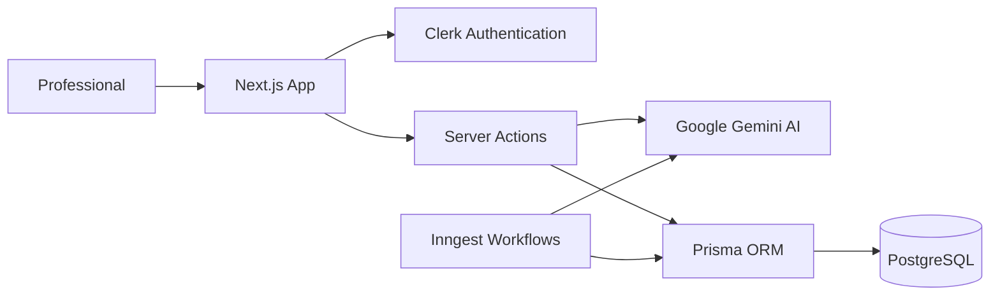
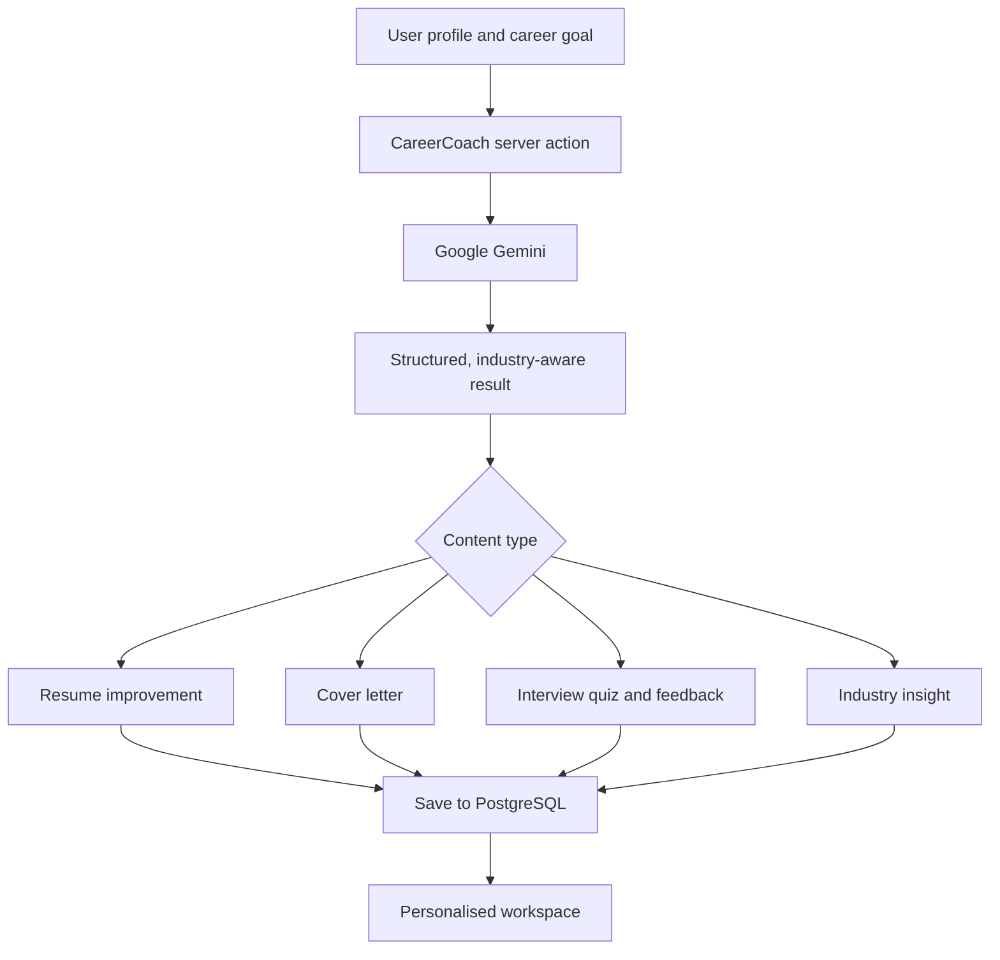

<div align="center">

# 🚀 CareerCoach AI

### Your AI-powered companion for confident career growth

Build stronger application materials, prepare for interviews, and make informed career decisions with personalised, industry-aware AI guidance.

[](YOUR_LIVE_PREVIEW_URL)
[](https://github.com/kithusibrian/AI-Career-coach-and-Resume-Builder)

<p>
  
  
  
  
  
  
  
</p>

_CareerCoach brings resume writing, interview practice, cover-letter creation, and live industry intelligence together in one focused workspace._

</div>

---

## 📖 Overview

CareerCoach is a full-stack career development platform designed to help professionals present their best work and prepare with purpose. After a short onboarding flow, the application tailors its guidance to the user's industry, experience, and skills.

Google Gemini powers context-aware suggestions for resumes, cover letters, interview questions, performance feedback, and industry insights. Clerk handles secure authentication, while Prisma and PostgreSQL persist each user's profile and career progress. Inngest runs scheduled background workflows that refresh industry intelligence.

---

## ✨ Key Features

### 🧠 Personalised career dashboard

- Onboarding that captures industry, experience, skills, and professional profile details
- Industry-specific salary ranges, demand signals, growth outlooks, key trends, and recommended skills
- A single dashboard for tracking career development activity

### 📄 Smart resume builder

- Build a structured, ATS-friendly resume with education, experience, projects, and skills
- Improve individual descriptions with AI-driven, achievement-focused suggestions
- Edit in Markdown, preview the result instantly, and export it as a PDF
- Save a resume securely to your profile

### ✉️ AI cover-letter generation

- Create tailored cover letters for a target role and company
- Adapt application content to the job description and your professional background
- Store and revisit generated letters from your workspace

### 🎯 Interview preparation

- Generate technical interview questions tailored to the selected industry
- Complete practice quizzes and receive a score
- Review previous assessments, answers, and AI-generated improvement tips
- Visualise performance over time to identify where to focus next

### 🔐 Secure, responsive experience

- Sign-up, sign-in, protected routes, and session management via Clerk
- Responsive interface built for desktop, tablet, and mobile
- Polished dark-mode design using Tailwind CSS, shadcn/ui, and Lucide icons

---

## 📸 Screenshots

> Add your screenshots to `public/screenshots/`, then replace the placeholder paths below. A 16:9 image works especially well for the wide previews.

| Career Dashboard | Resume Builder |
| --- | --- |
|  |  |

| Interview Practice | AI Cover Letter |
| --- | --- |
|  |  |

---

## 🛠 Tech Stack

| Area | Technology |
| --- | --- |
| Framework | Next.js 16, React 19, App Router |
| Styling | Tailwind CSS v4, shadcn/ui, Lucide React |
| AI | Google Gemini |
| Authentication | Clerk |
| Database | PostgreSQL, Prisma ORM |
| Validation & Forms | Zod, React Hook Form |
| Charts | Recharts |
| PDF Export | html2pdf.js |
| Background Workflows | Inngest |

---

## 🏗 Architecture



---

## 🤖 AI Workflow



---

## 📂 Project Structure

```text
app/                  # Routes, layouts, API route, and feature UI
├── (main)/           # Authenticated dashboard, resume, interview, and cover-letter pages
├── api/inngest/      # Inngest webhook endpoint
└── lib/              # Form schemas and helpers
actions/              # Server actions for user, dashboard, resume, and interview data
components/           # Shared UI, navigation, and landing-page components
data/                 # Landing-page content and industry data
lib/                  # Prisma client, Inngest client, and background functions
prisma/               # Database schema and migrations
public/               # Static images and future README screenshots
```

---

## ⚙️ Getting Started

### 1. Clone the repository

```bash
git clone https://github.com/kithusibrian/AI-Career-coach-and-Resume-Builder.git
cd AI-Career-coach-and-Resume-Builder
```

### 2. Install dependencies

```bash
npm install
```

### 3. Configure environment variables

Create a `.env.local` file in the project root:

```env
# Database
DATABASE_URL=

# Clerk authentication
NEXT_PUBLIC_CLERK_PUBLISHABLE_KEY=
CLERK_SECRET_KEY=

# Google Gemini
GEMINI_API_KEY=

# Inngest (required when running background workflows)
INNGEST_EVENT_KEY=
INNGEST_SIGNING_KEY=
```

### 4. Prepare the database

```bash
npx prisma generate
npx prisma migrate dev
```

### 5. Start the development server

```bash
npm run dev
```

Open [http://localhost:3000](http://localhost:3000) in your browser.

---

## 📦 Production Build

```bash
npm run build
npm start
```

---

## 💡 Skills Demonstrated

- Full-stack development with Next.js App Router
- AI integration and prompt design with Google Gemini
- Server Actions and protected application flows
- Authentication and user management with Clerk
- Relational data modelling with Prisma and PostgreSQL
- Resume and cover-letter generation
- Interview assessment design, feedback, and analytics
- PDF generation and responsive UI development
- Background job orchestration with Inngest

---

## 🛣️ Future Improvements

- Job-description matching and ATS scoring
- Application tracker with status reminders
- Behavioural interview simulations with spoken answers
- Shareable resume templates and public portfolio links
- Calendar integration for interview scheduling
- Multi-language support

---

## 🤝 Contributing

Contributions are welcome.

1. Fork the repository.
2. Create a feature branch: `git checkout -b feature/your-feature`.
3. Commit your changes: `git commit -m "Add your feature"`.
4. Push to your fork and open a pull request.

---

## 📄 License

This project is licensed under the MIT License.

---

<div align="center">

### ⭐ If CareerCoach helped inspire your next career move, consider giving the project a star.

**Built with ❤️ using Next.js, Google Gemini, Clerk, Prisma, PostgreSQL, and Inngest.**

</div>
